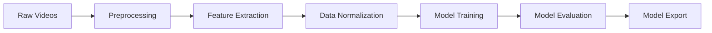

<div align="center">

# SignAI - Sign Language Translator (DGS)

[](https://www.python.org/downloads/)
[](https://tensorflow.org/)
[](LICENSE)
[](https://github.com/CodeProTech/SignAI/commits/main)

<p align="center">
  <a href="#-demo">Demo</a> •
  <a href="#-features">Features</a> •
  <a href="#-installation">Installation</a> •
  <a href="#-usage">Usage</a> •
  <a href="#-technical-architecture">Architecture</a>
</p>

</div>

## 📝 Description

<div align="center">
SignAI is an innovative sign language recognition system that uses artificial intelligence to interpret and translate sign language in real-time. Built with Python, JavaScript, and modern web technologies, this project aims to bridge communication gaps between the deaf community and others.
</div>

## 🎥 Demo

<div align="center">

### 🌐 [Try SignAI Live Demo](https://signai-t2cx.onrender.com/)


</div>

## ✨ Features

<div align="center">

| Feature | Description |
|---------|-------------|
| 🎯 **Real-time Recognition** | Instant sign language interpretation (4 words, expanding to 40-50) |
| 🤖 **Advanced AI Model** | 99.37% validation accuracy |
| 📱 **Cross-platform** | Works on web and desktop |
| 🎨 **User-friendly Interface** | Intuitive design |
| 🔄 **Multiple Input Sources** | Camera or video upload |
| 📊 **Detailed Analytics** | Performance metrics and visualization |
| 🔒 **Privacy-focused** | All processing done locally |

</div>

## 📁 Project Structure

```
SignAI/
├── 📊 data/
│   ├── 📹 live/
│   │   ├── 🎥 video/              # Live recording storage
│   │   │   └── recorded_video      # Current recording
│   │   └── 📑 live_dataset.csv    # Processed live data
│   ├── 🎯 train_data/             # Processed training data
│   └── 📼 raw_data/               # Raw video recordings
│
├── 🧠 models/
│   └── trained_model_v21.keras     # Latest trained model
│
├── 🎨 static/ 
│   ├── 📝 css/                     # Styling files
│   │   └── [style sheets...]
│   └── 💻 js/                      # Frontend logic
│       ├── camera.js                # Camera handling
│       ├── processing.js            # Frontend processing
│       └── settings.js              # User settings
│
├── 🌐 templates/                   # Web interface
│   └── index.html                   # Main application page
│
├── 🚀 main.py                       # Application entry point
├── 🌍 webside.py                    # Flask web server
├── 🧮 model.py                      # Neural network architecture
├── 📚 train.py                      # Model training logic
├── 🔍 inference.py                  # Model prediction
├── 🎦 preprocessing_live_data.py    # Live data processing
├── 📊 preprocessing_train_data.py   # Training data processing
└── 🌐 preprecessing_livedata_web.py # Web preprocessing
```

## 🏗️ Technical Architecture

### 🤖 Model Architecture
The SignAI system uses a sophisticated sequence-to-sequence (Seq2Seq) model with the following components:

#### 🔄 Encoder
- Input Shape: `(1, 1086)` keypoints
- Layer Structure:
  1. Input Normalization
  2. Dense Layers (512 units) with ReLU
  3. Batch Normalization
  4. Dropout (0.3)
  5. Bidirectional LSTM

#### 📝 Decoder
- Embedding Layer
- LSTM Layer with Attention
- Dense Output Layer with Softmax

### 🎥 Data Processing Pipeline
1. **Video Input**
   - Frame Rate: 20 FPS
   - Resolution: Dynamic adaptation
   - Input Sources: Webcam or uploaded videos

2. **Feature Extraction** (preprocessing_live_data.py)
   - Face Landmarks (468 points)
   - Hand Gestures (21 points per hand)
   - Body Poses (33 points)
   - Total Features: 1086 keypoints

3. **Data Normalization**
   - Scaling based on shoulder width
   - Coordinate normalization
   - Temporal alignment

### 🌐 Web Interface
- **Frontend**: HTML5, CSS3, JavaScript
  - Real-time video processing
  - WebSocket communication
  - Responsive design

- **Backend**: Flask + SocketIO
  - Asynchronous video processing
  - Real-time inference
  - Session management

### 💾 Data Management
- **Live Data**:
  - Format: CSV
  - Storage: `/data/live/`
  - Processing: Real-time normalization

- **Training Data**:
  - Format: Structured CSV
  - Location: `/data/train_data/`
  - Preprocessing: Batch normalization

### 🔄 Training Pipeline


### 🎯 Model Performance
- Training Accuracy: 99.89%
- Validation Accuracy: 99.37%
- Training Loss: 0.2434
- Validation Loss: 0.2712
- Batch Size: 16
- Learning Rate: 0.001 with AdamW optimizer
- Dropout Rate: 0.3


## 📥 Installation

1. Clone the repository:
```bash
git clone https://github.com/CodeProTech/SignAI.git
cd SignAI
```

2. Create a virtual environment:
```bash
python -m venv venv
source venv/bin/activate  # On Windows: venv\Scripts\activate
```

3. Install required packages:
```bash
pip install -r requirements.txt
```


## 🎯 Usage

### Desktop Application (only console)
```bash
python main.py
```

### Web Interface
```bash
python webside.py
```

### Controls
- **SPACE** - Start/Pause recording
- **Q** - End recording

## 🔧 Configuration
Key configuration options in `.env`:
```env
DEBUG=True
PORT=3000
MODEL_PATH=./models/
```

## 🏆 Awards & Recognition

<div align="center">

### 🥈 2nd Place - Jugend Forscht 2025

### 📰 Media Coverage
[](https://www.sueddeutsche.de/muenchen/freising/flughafen-muenchen-jugend-forscht-li.3209469)

[comment]: <> (### 🚀 HackClub Shipwrecked Viral Project)

</div>


## 📬 Contact & Support

<div align="center">

[](mailto:stefanoskoufogazos@outlook.com)

</div>

## 📄 License

<div align="center">

This project is protected under a non-commercial license.  
All rights reserved © 2025 SignAI

</div>

---

<div align="center">

Created with ❤️ by [@CodeProTech](https://github.com/CodeProTech)

Last Updated: 2025-06-10 14:32:21 UTC

</div>
